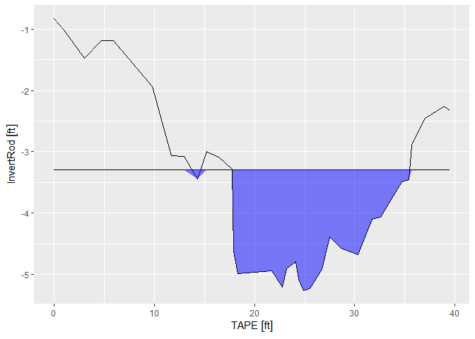

<!-- README.md is generated from README.Rmd. Please edit that file -->

# excess

<!-- badges: start -->
<!-- badges: end -->

The `excess` package is designed to provide a set of tools and workflows
to analyze and interpret hydrological cross-sectional data. This package
is currently in development, so use with caution :smile:.

## Installation

You can install the development version of excess from
[GitHub](https://github.com/) with:

``` r
# install.packages("devtools")
devtools::install_github("brownhr/excess")
```

## Calculating cross-sectional area

Under the hood, the `xs_area()` function calculates the area of a
cross-section through use of the **trapezoidal rule**, as provided by
the `pracma` package.

``` r
library(excess)
library(units)
#> udunits database from C:/Users/brownhr/AppData/Local/R/cache/R/renv/cache/v5/R-4.2/x86_64-w64-mingw32/units/0.8-0/6c374b265ba437f8d384ec7a313edd96/units/share/udunits/udunits2.xml
library(dplyr)
#> 
#> Attaching package: 'dplyr'
#> The following objects are masked from 'package:stats':
#> 
#>     filter, lag
#> The following objects are masked from 'package:base':
#> 
#>     intersect, setdiff, setequal, union

head(testxs)
#> # A tibble: 6 × 3
#>   TAPE InvertRod Bankful
#>   [ft]      [ft]    [ft]
#> 1 0        -0.83   -3.29
#> 2 1        -1.01   -3.29
#> 3 3        -1.48   -3.29
#> 4 4.7      -1.19   -3.29
#> 5 5.95     -1.19   -3.29
#> 6 9.8      -1.93   -3.29
```

``` r
## If you can't find the `testdata` object, load it with data()

data(testxs)
```

``` r
testxs %>% 
  xs_area(tape = TAPE,
          depth = InvertRod,
          baseline = Bankful,
          sum_area = T)
#> -23.4665 [ft^2]
```

You can visualize cross-sections with `xs_ribbon()`

``` r
xs_ribbon(testxs)
```



For more information, check out the vignettes by navigating to
<https://brownhr.github.io/excess>
